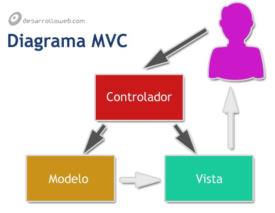

# ¿Qué es MVC? #

[desarrolloweb.com](https://desarrolloweb.com/articulos/que-es-mvc.html)

- Modelo de arquitectura de software que separa el código por sus distintas responsabilidades, cada capa se ocupa de hacer una tarea definida

- Se usa principalmente en sistemas donde se requiere el **uso de interfaces de usuario**

Un ejemplo de desarrollo web es que en los comienzos de la web, se utilizaban etiquetas como *font* o atributos como *bgcolor* dentro del HTML para definir estilo. Esto es bastante engorroso ya que si hay que hacer algún cambio de estilo, hay que cambiar las etiquetas y atributos de todos los archivos HTML. Para solucionar esto se creó el lenguaje CSS, que **separó la responsabilidad de aplicar el formato de un sitio web.**

Otro ejemplo es si tenemos datos de un artículo en la página del artículo, en la página de listado de artículos y en el backend donde se administran los artículos del sitio web. Si tenemos que hacer un cambio al artículo, tenemos que modificar todos los lugares donde se encuentre. En este caso seguramente estemos **repitiendo las mismas sentencias de código en lugares diferentes.**

## Componentes de MVC ##

- **Modelos:** es la capa donde se trabaja con los datos, tendremos mecanismos para acceder a la información y para actualizar su estado. Los datos usualmente estarán en una base de datos

- **Vistas:** tienen el código de la aplicación que va a crear la visualización de las interfaces de usuario (es el código que permite renderizar los estados de la aplicación en HTML). En la vista trabajamos con los datos de los modelos pero no se hace un acceso directo a ellos

- **Controladores:** es la capa que sirve de enlace entre las vistas y los modelos. No manipula directamente los datos ni muestra la salida de los mismos, solamente enlaza ambas partes de la forma en que se necesite

## Arquitectura de aplicaciones MVC ##

1. El usuario **hace una solicitud** a nuestro sitio web, la cual llega al controlador

2. **El controlador se comunica con modelos y vistas**: a los modeloes les solicita datos o les pide actualizar datos; a las vistas les pide la salida correspondiente, después de que hayan realizado las operaciones necesarias

3. Para producir la salida, **las vistas puede pedirle más información a los modelos**

4. **Las vistas envían al usuario la salida.** También puede pasar que la salida vaya al controlador y luego al usuario

## Lógica de negocio ##

**Lógica de negocio:** conjunto de reglas que se siguen en el software para reaccionar ante distintas situaciones.

Un usuario se comunica con el sistema por medio de una interfaz, pero *cuando realiza acciones en esa interfaz, se ejecutan una serie de procesos que se conocen como lógica del negocio*.

Además de marcar el comportamiento del software, **la lógica de negocio también tiene normas sobre lo que se puede hacer y lo que no se puede hacer**. Por ejemplo, tenemos un sistema con usuarios comunes y usuarios administradores. Los usuarios comunes se pueden borrar pero los usuarios administradores no (a menos que se le saque el rango de administrador).
